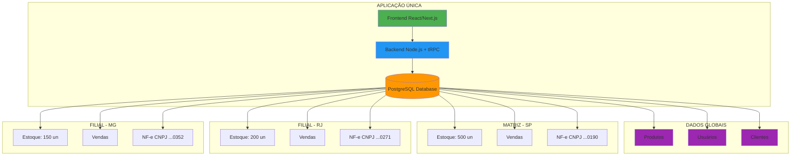
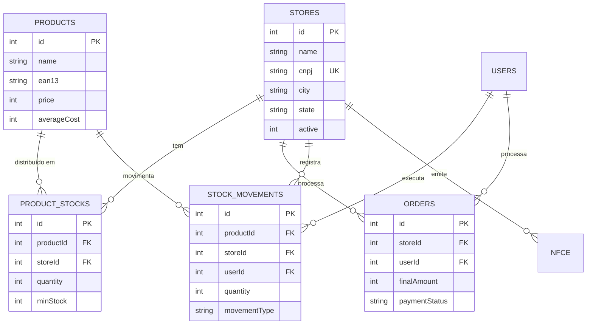
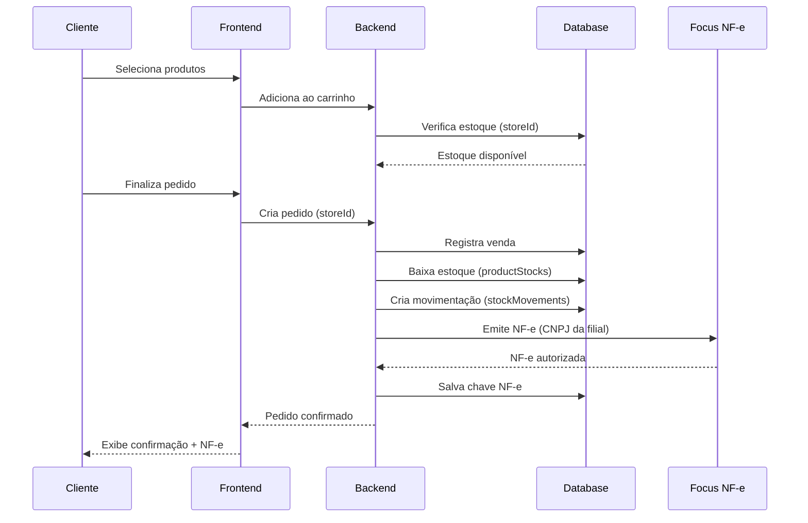
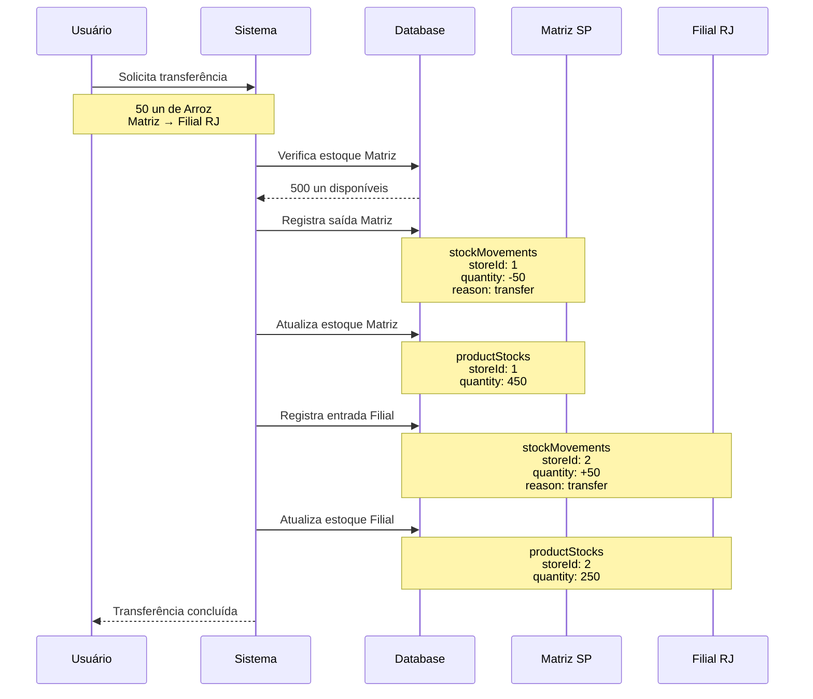
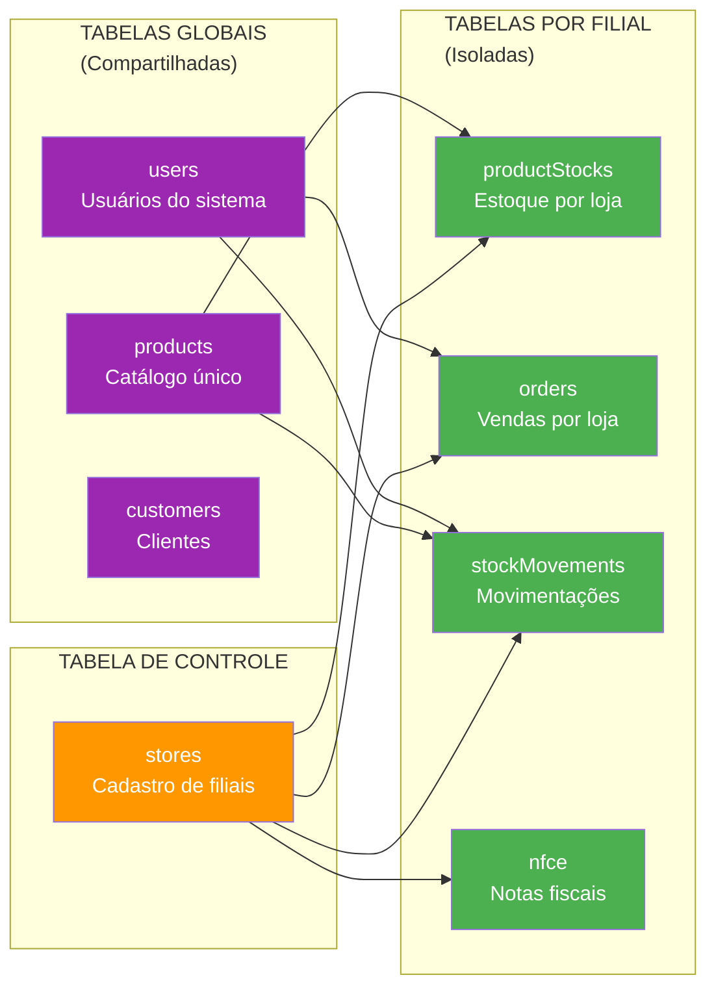
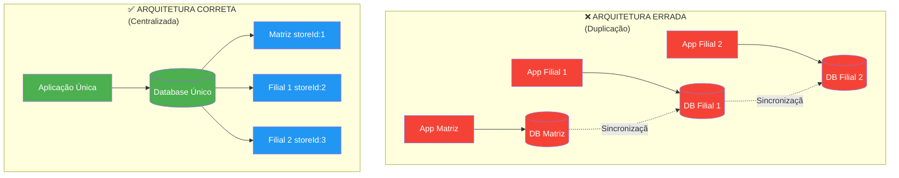
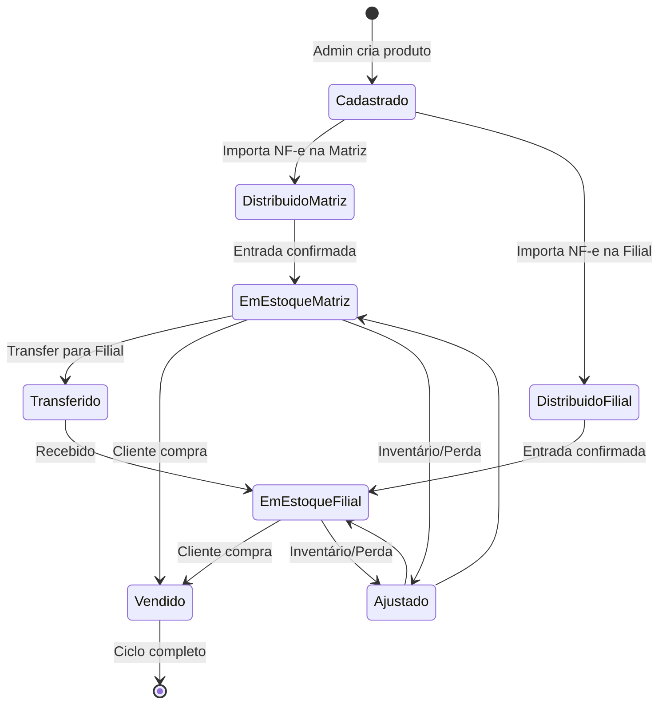
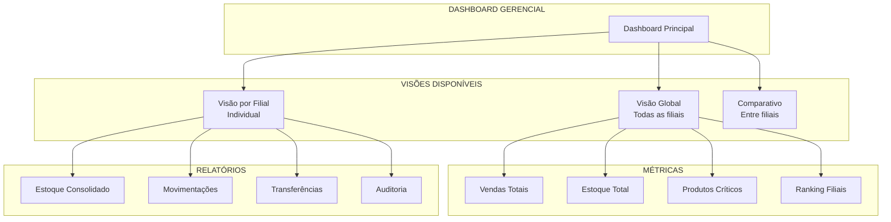

# 🎨 Diagramas da Arquitetura Multi-Filial

## 1. Arquitetura Geral do Sistema

## 2. Modelo de Dados Multi-Tenant

## 3. Fluxo de Venda Multi-Filial

## 4. Fluxo de Transferência Entre Filiais

## 5. Estrutura de Tabelas por Escopo

## 6. Expansão: Antes vs Depois

## 7. Ciclo de Vida de um Produto

## 8. Dashboard Multi-Filial

---

## 🎯 Legenda de Cores

- 🟣 **Roxo**: Dados Globais (compartilhados)
- 🟢 **Verde**: Dados por Filial (isolados)
- 🟠 **Laranja**: Controle/Configuração
- 🔵 **Azul**: Filiais/Lojas
- 🔴 **Vermelho**: Arquitetura incorreta (evitar)

---

## 📊 Resumo Visual

| Aspecto | Abordagem |
|---------|-----------|
| **Aplicação** | ✅ Única para todas |
| **Banco de Dados** | ✅ Único centralizado |
| **Produtos** | ✅ Catálogo compartilhado |
| **Estoque** | ✅ Isolado por filial |
| **Vendas** | ✅ Isolado por CNPJ |
| **NF-e** | ✅ Certificado por filial |
| **Usuários** | ✅ Acesso multi-filial |
| **Sincronização** | ❌ Não necessária |

---

**Nota**: Estes diagramas podem ser renderizados usando ferramentas que suportam Mermaid, como GitHub, GitLab, ou editores Markdown compatíveis.
