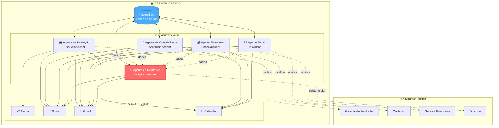
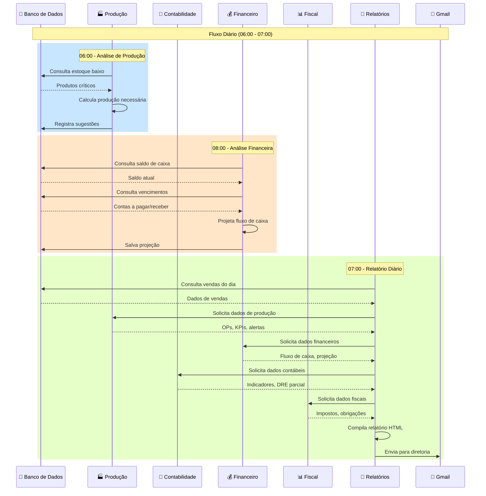
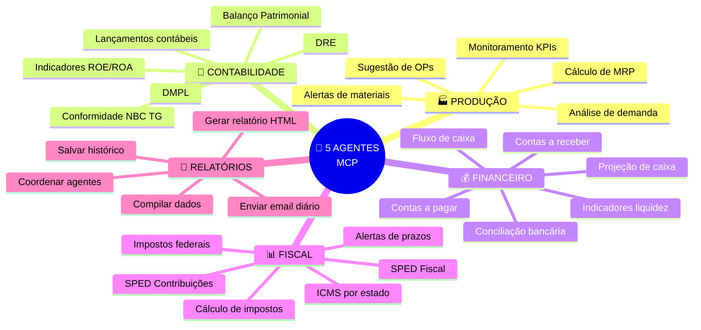
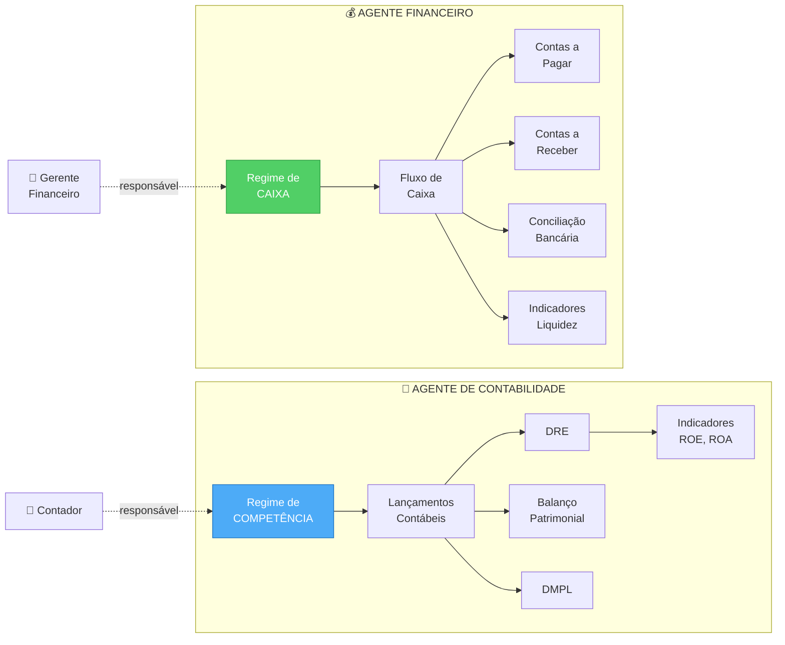
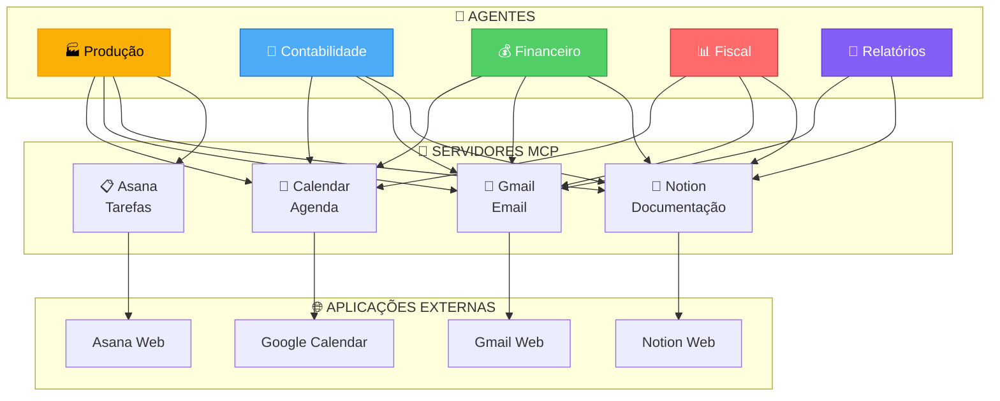
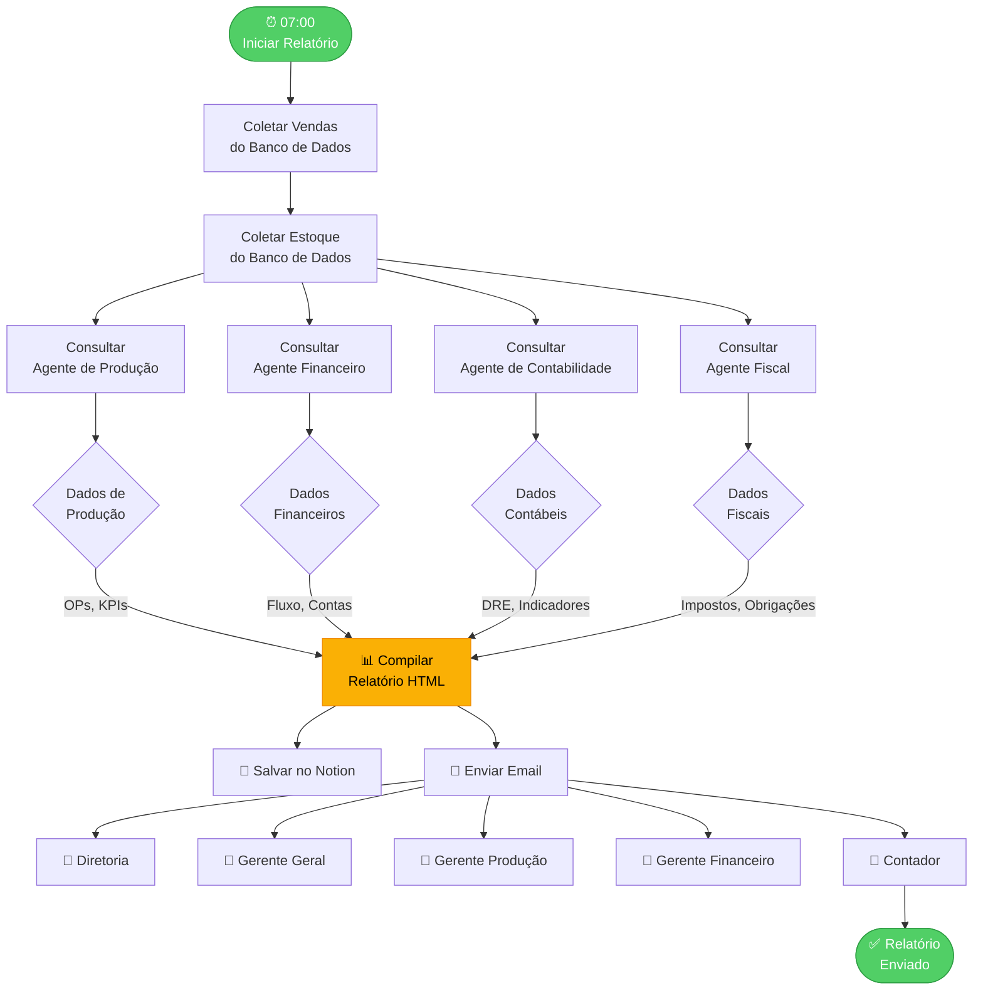
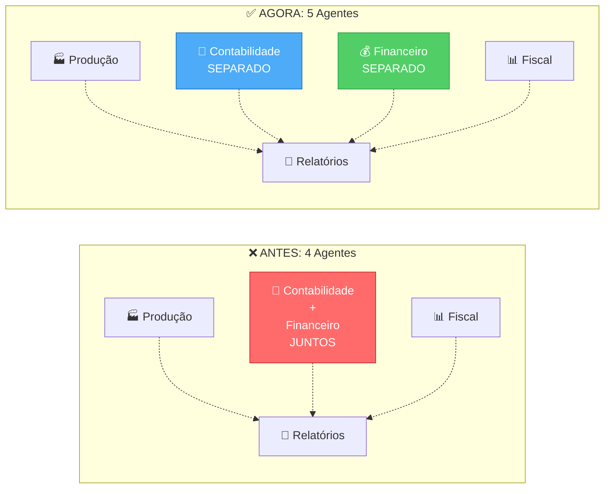
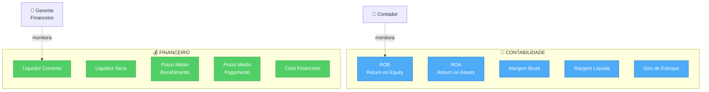
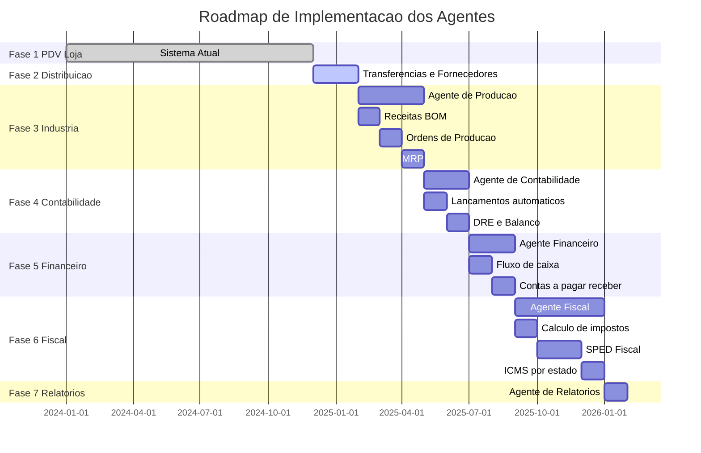

# 📊 Diagrama: 5 Agentes MCP do ERP Bem Casado

## 1. Arquitetura Geral dos Agentes

---

## 2. Fluxo de Dados Entre Agentes

---

## 3. Responsabilidades por Agente

---

## 4. Separação: Contabilidade vs Financeiro

---

## 5. Rotinas Automatizadas

```mermaid
gantt
    title Rotinas Automatizadas dos Agentes
    dateFormat HH:mm
    axisFormat %H:%M
    
    section Produção
    Análise de Demanda           :a1, 06:00, 30m
    
    section Relatórios
    Compilar Dados               :a5, 07:00, 30m
    Enviar Email Diário          :milestone, 07:30, 0m
    
    section Financeiro
    Atualizar Saldo              :a3, 08:00, 15m
    Verificar Vencimentos        :a3, 08:15, 15m
    Projetar Fluxo               :a3, 08:30, 20m
    
    section Contabilidade
    Validar Lançamentos          :a2, 09:00, 30m
    
    section Fiscal
    Calcular Impostos            :a4, 10:00, 30m
```

---

## 6. Integração com Servidores MCP

---

## 7. Fluxo de Relatório Diário

---

## 8. Comparação: Antes vs Depois

---

## 9. Indicadores por Agente

---

## 10. Roadmap de Implementação

---

**Diagramas preparados por**: Equipe de Arquitetura Bem Casado  
**Data**: Dezembro 2024  
**Versão**: 1.0
