# 📊 Diagrama: 5 Agentes MCP do ERP Bem Casado

## 1. Arquitetura Geral dos Agentes

---

## 2. Fluxo de Dados Entre Agentes

```mermaid
sequenceDiagram
    participant DB as 💾 Banco de Dados
    participant A1 as 🏭 Produção
    participant A2 as 💼 Contabilidade
    participant A3 as 💰 Financeiro
    participant A4 as 📊 Fiscal
    participant A5 as 📧 Relatórios
    participant Email as 📧 Gmail
    
    Note over DB,Email: Fluxo Diário (06:00 - 07:00)
    
    rect rgb(200, 230, 255)
        Note over A1: 06:00 - Análise de Produção
        A1->>DB: Consulta estoque baixo
        DB-->>A1: Produtos críticos
        A1->>A1: Calcula produção necessária
        A1->>DB: Registra sugestões
    end
    
    rect rgb(255, 230, 200)
        Note over A3: 08:00 - Análise Financeira
        A3->>DB: Consulta saldo de caixa
        DB-->>A3: Saldo atual
        A3->>DB: Consulta vencimentos
        DB-->>A3: Contas a pagar/receber
        A3->>A3: Projeta fluxo de caixa
        A3->>DB: Salva projeção
    end
    
    rect rgb(230, 255, 200)
        Note over A5: 07:00 - Relatório Diário
        A5->>DB: Consulta vendas do dia
        DB-->>A5: Dados de vendas
        
        A5->>A1: Solicita dados de produção
        A1-->>A5: OPs, KPIs, alertas
        
        A5->>A3: Solicita dados financeiros
        A3-->>A5: Fluxo de caixa, projeção
        
        A5->>A2: Solicita dados contábeis
        A2-->>A5: Indicadores, DRE parcial
        
        A5->>A4: Solicita dados fiscais
        A4-->>A5: Impostos, obrigações
        
        A5->>A5: Compila relatório HTML
        A5->>Email: Envia para diretoria
    end
```

---

## 3. Responsabilidades por Agente

```mermaid
mindmap
  root((🤖 5 AGENTES<br/>MCP))
    🏭 PRODUÇÃO
      Análise de demanda
      Sugestão de OPs
      Cálculo de MRP
      Monitoramento KPIs
      Alertas de materiais
    💼 CONTABILIDADE
      Lançamentos contábeis
      DRE
      Balanço Patrimonial
      DMPL
      Indicadores ROE/ROA
      Conformidade NBC TG
    💰 FINANCEIRO
      Fluxo de caixa
      Contas a pagar
      Contas a receber
      Conciliação bancária
      Projeção de caixa
      Indicadores liquidez
    📊 FISCAL
      Cálculo de impostos
      ICMS por estado
      Impostos federais
      SPED Fiscal
      SPED Contribuições
      Alertas de prazos
    📧 RELATÓRIOS
      Compilar dados
      Gerar relatório HTML
      Enviar email diário
      Salvar histórico
      Coordenar agentes
```

---

## 4. Separação: Contabilidade vs Financeiro

```mermaid
graph LR
    subgraph "💼 AGENTE DE CONTABILIDADE"
        AC1[Regime de<br/>COMPETÊNCIA]
        AC2[Lançamentos<br/>Contábeis]
        AC3[DRE]
        AC4[Balanço<br/>Patrimonial]
        AC5[DMPL]
        AC6[Indicadores<br/>ROE, ROA]
        
        AC1 --> AC2
        AC2 --> AC3
        AC2 --> AC4
        AC2 --> AC5
        AC3 --> AC6
    end
    
    subgraph "💰 AGENTE FINANCEIRO"
        AF1[Regime de<br/>CAIXA]
        AF2[Fluxo de<br/>Caixa]
        AF3[Contas a<br/>Pagar]
        AF4[Contas a<br/>Receber]
        AF5[Conciliação<br/>Bancária]
        AF6[Indicadores<br/>Liquidez]
        
        AF1 --> AF2
        AF2 --> AF3
        AF2 --> AF4
        AF2 --> AF5
        AF2 --> AF6
    end
    
    RESP1[👤 Contador] -.responsável.-> AC1
    RESP2[👤 Gerente<br/>Financeiro] -.responsável.-> AF1
    
    style AC1 fill:#4dabf7,stroke:#1971c2,color:#fff
    style AF1 fill:#51cf66,stroke:#2f9e44,color:#fff
```

---

## 5. Rotinas Automatizadas

```mermaid
gantt
    title Rotinas Automatizadas dos Agentes
    dateFormat HH:mm
    axisFormat %H:%M
    
    section Produção
    Análise de Demanda           :a1, 06:00, 30m
    
    section Relatórios
    Compilar Dados               :a5, 07:00, 30m
    Enviar Email Diário          :milestone, 07:30, 0m
    
    section Financeiro
    Atualizar Saldo              :a3, 08:00, 15m
    Verificar Vencimentos        :a3, 08:15, 15m
    Projetar Fluxo               :a3, 08:30, 20m
    
    section Contabilidade
    Validar Lançamentos          :a2, 09:00, 30m
    
    section Fiscal
    Calcular Impostos            :a4, 10:00, 30m
```

---

## 6. Integração com Servidores MCP

```mermaid
graph TB
    subgraph "🤖 AGENTES"
        A1[🏭 Produção]
        A2[💼 Contabilidade]
        A3[💰 Financeiro]
        A4[📊 Fiscal]
        A5[📧 Relatórios]
    end
    
    subgraph "🔧 SERVIDORES MCP"
        MCP1[📋 Asana<br/>Tarefas]
        MCP2[📝 Notion<br/>Documentação]
        MCP3[📧 Gmail<br/>Email]
        MCP4[📅 Calendar<br/>Agenda]
    end
    
    subgraph "🌐 APLICAÇÕES EXTERNAS"
        EXT1[Asana Web]
        EXT2[Notion Web]
        EXT3[Gmail Web]
        EXT4[Google Calendar]
    end
    
    %% Produção usa todos
    A1 --> MCP1
    A1 --> MCP2
    A1 --> MCP3
    A1 --> MCP4
    
    %% Contabilidade não usa Asana
    A2 --> MCP2
    A2 --> MCP3
    A2 --> MCP4
    
    %% Financeiro não usa Asana
    A3 --> MCP2
    A3 --> MCP3
    A3 --> MCP4
    
    %% Fiscal não usa Asana
    A4 --> MCP2
    A4 --> MCP3
    A4 --> MCP4
    
    %% Relatórios usa só Notion e Gmail
    A5 --> MCP2
    A5 --> MCP3
    
    %% Servidores MCP conectam às aplicações
    MCP1 --> EXT1
    MCP2 --> EXT2
    MCP3 --> EXT3
    MCP4 --> EXT4
    
    style A1 fill:#fab005,stroke:#f08c00,color:#000
    style A2 fill:#4dabf7,stroke:#1971c2,color:#fff
    style A3 fill:#51cf66,stroke:#2f9e44,color:#fff
    style A4 fill:#ff6b6b,stroke:#c92a2a,color:#fff
    style A5 fill:#845ef7,stroke:#5f3dc4,color:#fff
```

---

## 7. Fluxo de Relatório Diário

```mermaid
flowchart TD
    START([⏰ 07:00<br/>Iniciar Relatório])
    
    START --> VENDAS[Coletar Vendas<br/>do Banco de Dados]
    VENDAS --> ESTOQUE[Coletar Estoque<br/>do Banco de Dados]
    
    ESTOQUE --> PROD[Consultar<br/>Agente de Produção]
    PROD --> PROD_DATA{Dados de<br/>Produção}
    PROD_DATA -->|OPs, KPIs| COMPILE
    
    ESTOQUE --> FIN[Consultar<br/>Agente Financeiro]
    FIN --> FIN_DATA{Dados<br/>Financeiros}
    FIN_DATA -->|Fluxo, Contas| COMPILE
    
    ESTOQUE --> CONT[Consultar<br/>Agente de Contabilidade]
    CONT --> CONT_DATA{Dados<br/>Contábeis}
    CONT_DATA -->|DRE, Indicadores| COMPILE
    
    ESTOQUE --> FISC[Consultar<br/>Agente Fiscal]
    FISC --> FISC_DATA{Dados<br/>Fiscais}
    FISC_DATA -->|Impostos, Obrigações| COMPILE
    
    COMPILE[📊 Compilar<br/>Relatório HTML]
    
    COMPILE --> NOTION[💾 Salvar no Notion]
    COMPILE --> EMAIL[📧 Enviar Email]
    
    EMAIL --> DEST1[👤 Diretoria]
    EMAIL --> DEST2[👤 Gerente Geral]
    EMAIL --> DEST3[👤 Gerente Produção]
    EMAIL --> DEST4[👤 Gerente Financeiro]
    EMAIL --> DEST5[👤 Contador]
    
    DEST5 --> END([✅ Relatório<br/>Enviado])
    
    style START fill:#51cf66,stroke:#2f9e44,color:#fff
    style COMPILE fill:#fab005,stroke:#f08c00,color:#000
    style END fill:#51cf66,stroke:#2f9e44,color:#fff
```

---

## 8. Comparação: Antes vs Depois

```mermaid
graph LR
    subgraph "❌ ANTES: 4 Agentes"
        B1[🏭 Produção]
        B2[💼 Contabilidade<br/>+<br/>Financeiro<br/>JUNTOS]
        B3[📊 Fiscal]
        B4[📧 Relatórios]
        
        B1 -.-> B4
        B2 -.-> B4
        B3 -.-> B4
    end
    
    subgraph "✅ AGORA: 5 Agentes"
        A1[🏭 Produção]
        A2[💼 Contabilidade<br/>SEPARADO]
        A3[💰 Financeiro<br/>SEPARADO]
        A4[📊 Fiscal]
        A5[📧 Relatórios]
        
        A1 -.-> A5
        A2 -.-> A5
        A3 -.-> A5
        A4 -.-> A5
    end
    
    style B2 fill:#ff6b6b,stroke:#c92a2a,color:#fff
    style A2 fill:#4dabf7,stroke:#1971c2,color:#fff
    style A3 fill:#51cf66,stroke:#2f9e44,color:#fff
```

---

## 9. Indicadores por Agente

```mermaid
graph TB
    subgraph "💼 CONTABILIDADE"
        IND_C1[ROE<br/>Return on Equity]
        IND_C2[ROA<br/>Return on Assets]
        IND_C3[Margem Bruta]
        IND_C4[Margem Líquida]
        IND_C5[Giro de Estoque]
    end
    
    subgraph "💰 FINANCEIRO"
        IND_F1[Liquidez Corrente]
        IND_F2[Liquidez Seca]
        IND_F3[Prazo Médio<br/>Recebimento]
        IND_F4[Prazo Médio<br/>Pagamento]
        IND_F5[Ciclo Financeiro]
    end
    
    CONTADOR[👤 Contador] -.monitora.-> IND_C1
    GERENTE[👤 Gerente<br/>Financeiro] -.monitora.-> IND_F1
    
    style IND_C1 fill:#4dabf7,stroke:#1971c2,color:#fff
    style IND_C2 fill:#4dabf7,stroke:#1971c2,color:#fff
    style IND_C3 fill:#4dabf7,stroke:#1971c2,color:#fff
    style IND_C4 fill:#4dabf7,stroke:#1971c2,color:#fff
    style IND_C5 fill:#4dabf7,stroke:#1971c2,color:#fff
    
    style IND_F1 fill:#51cf66,stroke:#2f9e44,color:#fff
    style IND_F2 fill:#51cf66,stroke:#2f9e44,color:#fff
    style IND_F3 fill:#51cf66,stroke:#2f9e44,color:#fff
    style IND_F4 fill:#51cf66,stroke:#2f9e44,color:#fff
    style IND_F5 fill:#51cf66,stroke:#2f9e44,color:#fff
```

---

## 10. Roadmap de Implementação

---

**Diagramas preparados por**: Equipe de Arquitetura Bem Casado  
**Data**: Dezembro 2024  
**Versão**: 1.0
