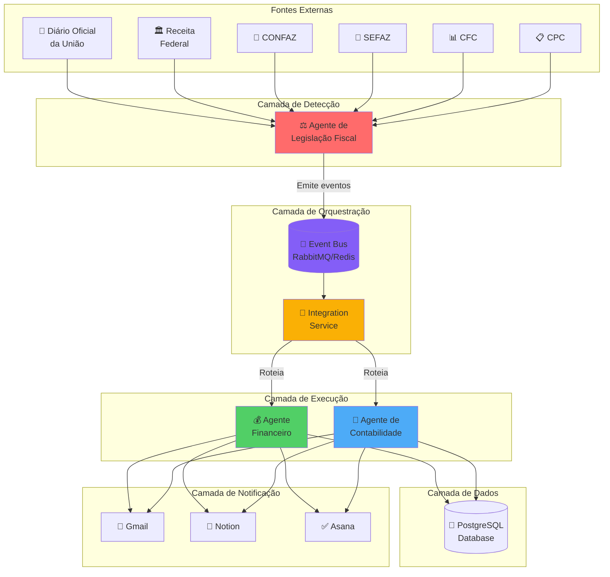
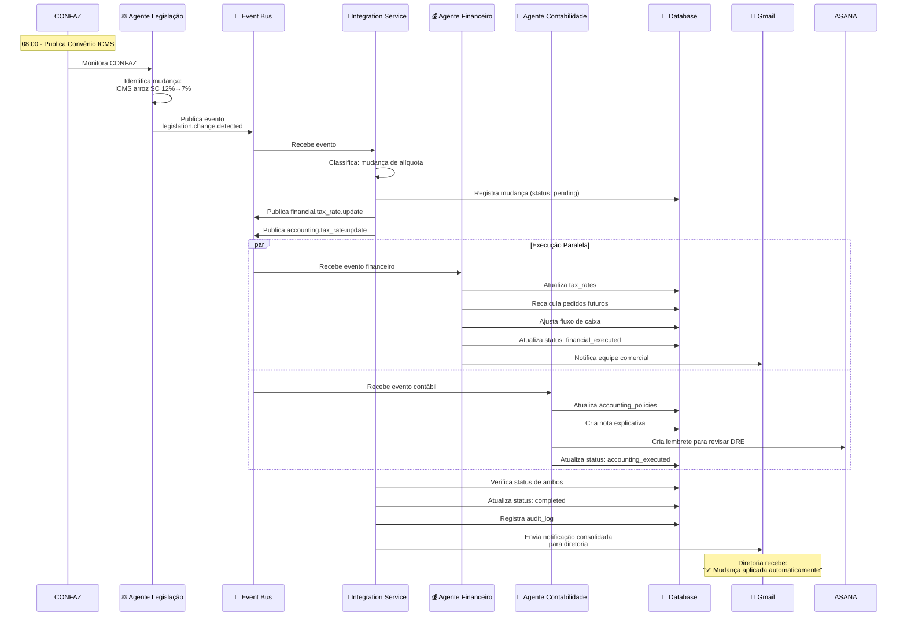
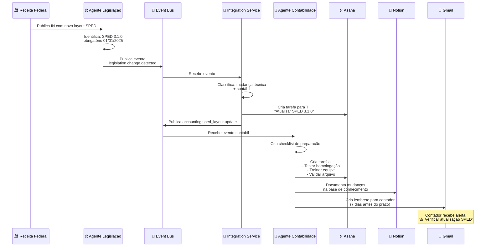
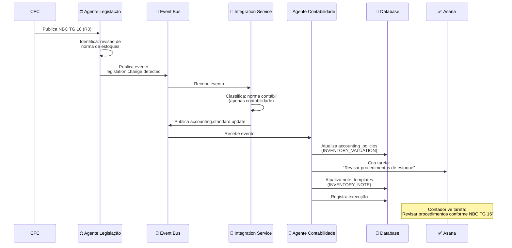
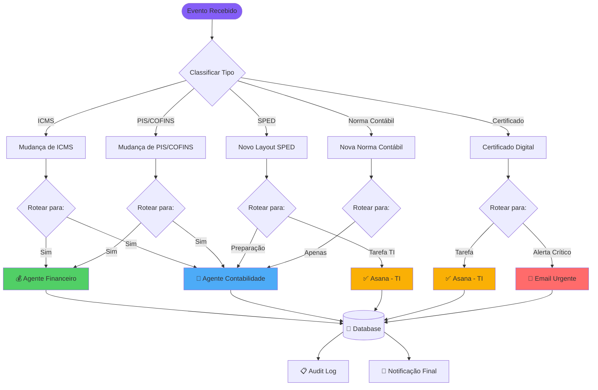
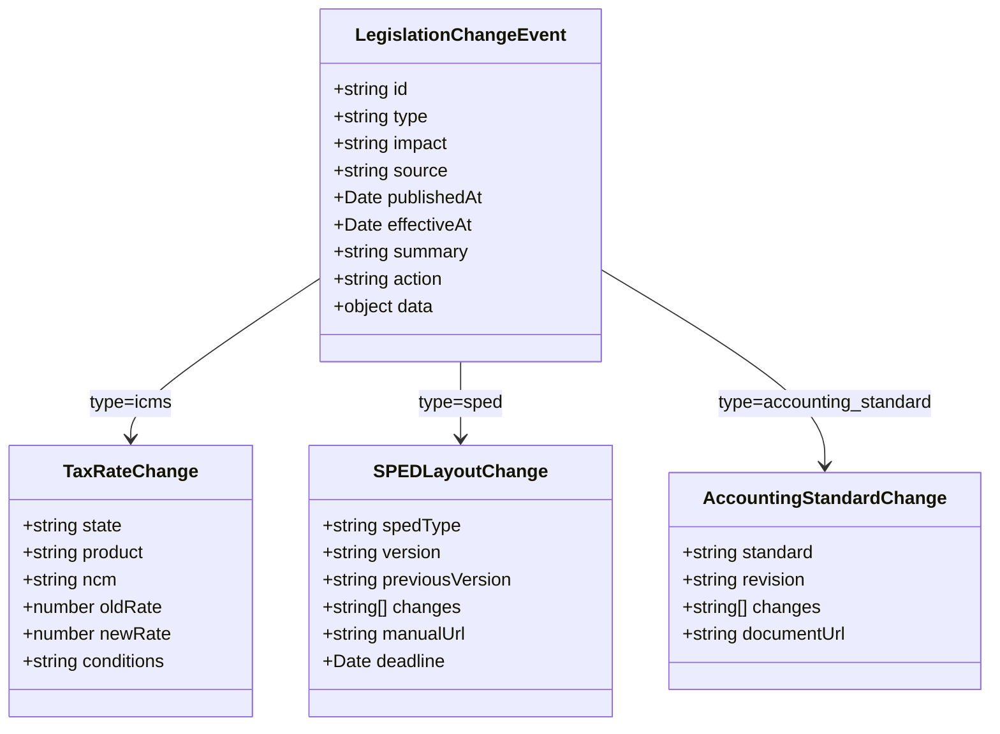
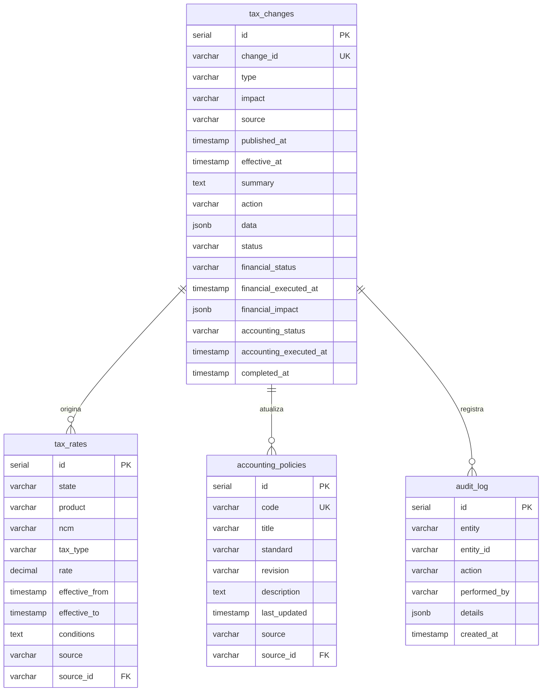
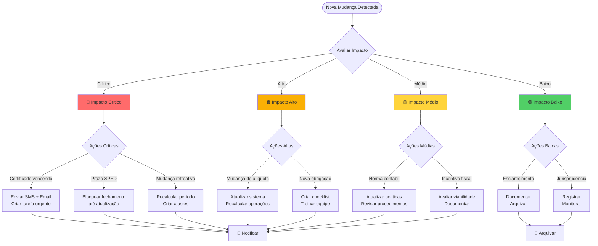
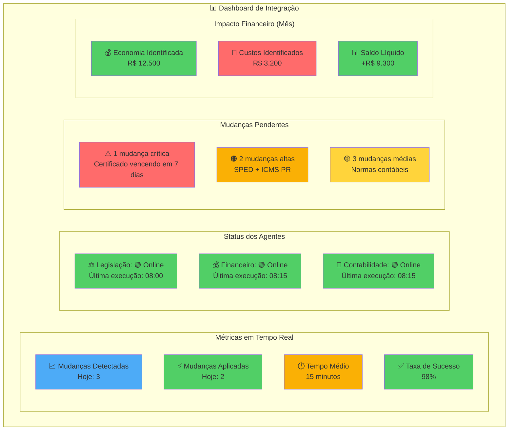

# 🔄 Diagramas de Integração dos Agentes Fiscais

Este documento contém diagramas visuais (Mermaid) mostrando os fluxos de integração entre os agentes de Legislação Fiscal, Financeiro e Contabilidade.

---

## 1. Arquitetura Geral do Sistema

---

## 2. Fluxo Completo: Mudança de Alíquota de ICMS

---

## 3. Fluxo: Novo Layout de SPED

---

## 4. Fluxo: Nova Norma Contábil (NBC TG)

---

## 5. Decisão de Roteamento (Integration Service)

---

## 6. Estrutura de Dados: Evento de Mudança Legislativa

---

## 7. Modelo de Dados: Tabelas Principais

---

## 8. Timeline: Execução de Mudança de ICMS

```mermaid
gantt
    title Execução Automatizada de Mudança de ICMS
    dateFormat HH:mm
    axisFormat %H:%M
    
    section Detecção
    Monitoramento CONFAZ           :done, 08:00, 1m
    Identificação de mudança       :done, 08:01, 1m
    Emissão de evento              :done, 08:02, 1m
    
    section Orquestração
    Classificação                  :done, 08:03, 1m
    Registro no banco              :done, 08:04, 1m
    Roteamento para agentes        :done, 08:05, 1m
    
    section Execução Financeira
    Atualização de alíquotas       :active, 08:06, 2m
    Recálculo de pedidos           :active, 08:08, 5m
    Ajuste de fluxo de caixa       :active, 08:13, 2m
    
    section Execução Contábil
    Atualização de políticas       :active, 08:06, 3m
    Criação de notas explicativas  :active, 08:09, 2m
    Criação de lembretes           :active, 08:11, 1m
    
    section Finalização
    Verificação de status          :crit, 08:15, 1m
    Registro de auditoria          :crit, 08:16, 1m
    Notificação consolidada        :crit, 08:17, 1m
```

---

## 9. Fluxo de Decisão: Impacto de Mudança

---

## 10. Dashboard de Monitoramento (Conceitual)

---

**Documento preparado por**: Equipe de Arquitetura Bem Casado  
**Data**: Dezembro 2024  
**Versão**: 1.0
