# 🔄 Diagramas de Integração dos Agentes Fiscais

Este documento contém diagramas visuais (Mermaid) mostrando os fluxos de integração entre os agentes de Legislação Fiscal, Financeiro e Contabilidade.

---

## 1. Arquitetura Geral do Sistema

---

## 2. Fluxo Completo: Mudança de Alíquota de ICMS

```mermaid
sequenceDiagram
    participant CONFAZ
    participant TLA as ⚖️ Agente Legislação
    participant EB as 🔄 Event Bus
    participant IS as 🎯 Integration Service
    participant FA as 💰 Agente Financeiro
    participant AA as 💼 Agente Contabilidade
    participant DB as 💾 Database
    participant EMAIL as 📧 Gmail
    
    Note over CONFAZ: 08:00 - Publica Convênio ICMS
    CONFAZ->>TLA: Monitora CONFAZ
    TLA->>TLA: Identifica mudança:<br/>ICMS arroz SC 12%→7%
    TLA->>EB: Publica evento<br/>legislation.change.detected
    
    EB->>IS: Recebe evento
    IS->>IS: Classifica: mudança de alíquota
    IS->>DB: Registra mudança (status: pending)
    IS->>EB: Publica financial.tax_rate.update
    IS->>EB: Publica accounting.tax_rate.update
    
    par Execução Paralela
        EB->>FA: Recebe evento financeiro
        FA->>DB: Atualiza tax_rates
        FA->>DB: Recalcula pedidos futuros
        FA->>DB: Ajusta fluxo de caixa
        FA->>DB: Atualiza status: financial_executed
        FA->>EMAIL: Notifica equipe comercial
    and
        EB->>AA: Recebe evento contábil
        AA->>DB: Atualiza accounting_policies
        AA->>DB: Cria nota explicativa
        AA->>ASANA: Cria lembrete para revisar DRE
        AA->>DB: Atualiza status: accounting_executed
    end
    
    IS->>DB: Verifica status de ambos
    IS->>DB: Atualiza status: completed
    IS->>DB: Registra audit_log
    IS->>EMAIL: Envia notificação consolidada<br/>para diretoria
    
    Note over EMAIL: Diretoria recebe:<br/>"✅ Mudança aplicada automaticamente"
```

---

## 3. Fluxo: Novo Layout de SPED

```mermaid
sequenceDiagram
    participant RFB as 🏛️ Receita Federal
    participant TLA as ⚖️ Agente Legislação
    participant EB as 🔄 Event Bus
    participant IS as 🎯 Integration Service
    participant AA as 💼 Agente Contabilidade
    participant ASANA as ✅ Asana
    participant NOTION as 📝 Notion
    participant EMAIL as 📧 Gmail
    
    RFB->>TLA: Publica IN com novo layout SPED
    TLA->>TLA: Identifica: SPED 3.1.0<br/>obrigatório 01/01/2025
    TLA->>EB: Publica evento<br/>legislation.change.detected
    
    EB->>IS: Recebe evento
    IS->>IS: Classifica: mudança técnica<br/>+ contábil
    IS->>ASANA: Cria tarefa para TI:<br/>"Atualizar SPED 3.1.0"
    IS->>EB: Publica accounting.sped_layout.update
    
    EB->>AA: Recebe evento contábil
    AA->>AA: Cria checklist de preparação
    AA->>ASANA: Cria tarefas:<br/>- Testar homologação<br/>- Treinar equipe<br/>- Validar arquivo
    AA->>NOTION: Documenta mudanças<br/>na base de conhecimento
    AA->>EMAIL: Cria lembrete para contador<br/>(7 dias antes do prazo)
    
    Note over EMAIL: Contador recebe alerta:<br/>"⚠️ Verificar atualização SPED"
```

---

## 4. Fluxo: Nova Norma Contábil (NBC TG)

```mermaid
sequenceDiagram
    participant CFC
    participant TLA as ⚖️ Agente Legislação
    participant EB as 🔄 Event Bus
    participant IS as 🎯 Integration Service
    participant AA as 💼 Agente Contabilidade
    participant DB as 💾 Database
    participant ASANA as ✅ Asana
    
    CFC->>TLA: Publica NBC TG 16 (R3)
    TLA->>TLA: Identifica: revisão de<br/>norma de estoques
    TLA->>EB: Publica evento<br/>legislation.change.detected
    
    EB->>IS: Recebe evento
    IS->>IS: Classifica: norma contábil<br/>(apenas contabilidade)
    IS->>EB: Publica accounting.standard.update
    
    EB->>AA: Recebe evento
    AA->>DB: Atualiza accounting_policies<br/>(INVENTORY_VALUATION)
    AA->>ASANA: Cria tarefa:<br/>"Revisar procedimentos de estoque"
    AA->>DB: Atualiza note_templates<br/>(INVENTORY_NOTE)
    AA->>DB: Registra execução
    
    Note over ASANA: Contador vê tarefa:<br/>"Revisar procedimentos conforme NBC TG 16"
```

---

## 5. Decisão de Roteamento (Integration Service)

```mermaid
flowchart TD
    Start([Evento Recebido]) --> Classify{Classificar Tipo}
    
    Classify -->|ICMS| ICMS[Mudança de ICMS]
    Classify -->|PIS/COFINS| PISCOFINS[Mudança de PIS/COFINS]
    Classify -->|SPED| SPED[Novo Layout SPED]
    Classify -->|Certificado| CERT[Certificado Digital]
    Classify -->|Norma Contábil| NBC[Nova Norma Contábil]
    
    ICMS --> RouteICMS{Rotear para:}
    RouteICMS -->|Sim| FA[💰 Agente Financeiro]
    RouteICMS -->|Sim| AA[💼 Agente Contabilidade]
    
    PISCOFINS --> RoutePIS{Rotear para:}
    RoutePIS -->|Sim| FA
    RoutePIS -->|Sim| AA
    
    SPED --> RouteSPED{Rotear para:}
    RouteSPED -->|Tarefa TI| ASANA[✅ Asana - TI]
    RouteSPED -->|Preparação| AA
    
    CERT --> RouteCERT{Rotear para:}
    RouteCERT -->|Alerta Crítico| EMAIL[📧 Email Urgente]
    RouteCERT -->|Tarefa| ASANA2[✅ Asana - TI]
    
    NBC --> RouteNBC{Rotear para:}
    RouteNBC -->|Apenas| AA
    
    FA --> DB[(💾 Database)]
    AA --> DB
    ASANA --> DB
    ASANA2 --> DB
    EMAIL --> DB
    
    DB --> Audit[📋 Audit Log]
    DB --> Notify[📧 Notificação Final]
    
    style Start fill:#845ef7
    style FA fill:#51cf66
    style AA fill:#4dabf7
    style ASANA fill:#fab005
    style ASANA2 fill:#fab005
    style EMAIL fill:#ff6b6b
```

---

## 6. Estrutura de Dados: Evento de Mudança Legislativa

---

## 7. Modelo de Dados: Tabelas Principais

---

## 8. Timeline: Execução de Mudança de ICMS

```mermaid
gantt
    title Execução Automatizada de Mudança de ICMS
    dateFormat HH:mm
    axisFormat %H:%M
    
    section Detecção
    Monitoramento CONFAZ           :done, 08:00, 1m
    Identificação de mudança       :done, 08:01, 1m
    Emissão de evento              :done, 08:02, 1m
    
    section Orquestração
    Classificação                  :done, 08:03, 1m
    Registro no banco              :done, 08:04, 1m
    Roteamento para agentes        :done, 08:05, 1m
    
    section Execução Financeira
    Atualização de alíquotas       :active, 08:06, 2m
    Recálculo de pedidos           :active, 08:08, 5m
    Ajuste de fluxo de caixa       :active, 08:13, 2m
    
    section Execução Contábil
    Atualização de políticas       :active, 08:06, 3m
    Criação de notas explicativas  :active, 08:09, 2m
    Criação de lembretes           :active, 08:11, 1m
    
    section Finalização
    Verificação de status          :crit, 08:15, 1m
    Registro de auditoria          :crit, 08:16, 1m
    Notificação consolidada        :crit, 08:17, 1m
```

---

## 9. Fluxo de Decisão: Impacto de Mudança

```mermaid
flowchart TD
    Start([Nova Mudança Detectada]) --> AssessImpact{Avaliar Impacto}
    
    AssessImpact -->|Crítico| Critical[🔴 Impacto Crítico]
    AssessImpact -->|Alto| High[🟠 Impacto Alto]
    AssessImpact -->|Médio| Medium[🟡 Impacto Médio]
    AssessImpact -->|Baixo| Low[🟢 Impacto Baixo]
    
    Critical --> CritActions{Ações Críticas}
    CritActions -->|Certificado vencendo| CertAction[Enviar SMS + Email<br/>Criar tarefa urgente]
    CritActions -->|Prazo SPED| SPEDAction[Bloquear fechamento<br/>até atualização]
    CritActions -->|Mudança retroativa| RetroAction[Recalcular período<br/>Criar ajustes]
    
    High --> HighActions{Ações Altas}
    HighActions -->|Mudança de alíquota| RateAction[Atualizar sistema<br/>Recalcular operações]
    HighActions -->|Nova obrigação| ObligAction[Criar checklist<br/>Treinar equipe]
    
    Medium --> MediumActions{Ações Médias}
    MediumActions -->|Norma contábil| NBCAction[Atualizar políticas<br/>Revisar procedimentos]
    MediumActions -->|Incentivo fiscal| IncentAction[Avaliar viabilidade<br/>Documentar]
    
    Low --> LowActions{Ações Baixas}
    LowActions -->|Esclarecimento| ClarAction[Documentar<br/>Arquivar]
    LowActions -->|Jurisprudência| JurisAction[Registrar<br/>Monitorar]
    
    CertAction --> Notify[📧 Notificar]
    SPEDAction --> Notify
    RetroAction --> Notify
    RateAction --> Notify
    ObligAction --> Notify
    NBCAction --> Notify
    IncentAction --> Notify
    ClarAction --> Archive[📁 Arquivar]
    JurisAction --> Archive
    
    style Critical fill:#ff6b6b
    style High fill:#fab005
    style Medium fill:#ffd43b
    style Low fill:#51cf66
```

---

## 10. Dashboard de Monitoramento (Conceitual)

```mermaid
graph TB
    subgraph "📊 Dashboard de Integração"
        subgraph "Métricas em Tempo Real"
            M1[📈 Mudanças Detectadas<br/>Hoje: 3]
            M2[⚡ Mudanças Aplicadas<br/>Hoje: 2]
            M3[⏱️ Tempo Médio<br/>15 minutos]
            M4[✅ Taxa de Sucesso<br/>98%]
        end
        
        subgraph "Status dos Agentes"
            A1[⚖️ Legislação: 🟢 Online<br/>Última execução: 08:00]
            A2[💰 Financeiro: 🟢 Online<br/>Última execução: 08:15]
            A3[💼 Contabilidade: 🟢 Online<br/>Última execução: 08:15]
        end
        
        subgraph "Mudanças Pendentes"
            P1[⚠️ 1 mudança crítica<br/>Certificado vencendo em 7 dias]
            P2[🟠 2 mudanças altas<br/>SPED + ICMS PR]
            P3[🟡 3 mudanças médias<br/>Normas contábeis]
        end
        
        subgraph "Impacto Financeiro (Mês)"
            F1[💰 Economia Identificada<br/>R$ 12.500]
            F2[💸 Custos Identificados<br/>R$ 3.200]
            F3[📊 Saldo Líquido<br/>+R$ 9.300]
        end
    end
    
    style M1 fill:#4dabf7
    style M2 fill:#51cf66
    style M3 fill:#fab005
    style M4 fill:#51cf66
    style A1 fill:#51cf66
    style A2 fill:#51cf66
    style A3 fill:#51cf66
    style P1 fill:#ff6b6b
    style P2 fill:#fab005
    style P3 fill:#ffd43b
    style F1 fill:#51cf66
    style F2 fill:#ff6b6b
    style F3 fill:#51cf66
```

---

**Documento preparado por**: Equipe de Arquitetura Bem Casado  
**Data**: Dezembro 2024  
**Versão**: 1.0
